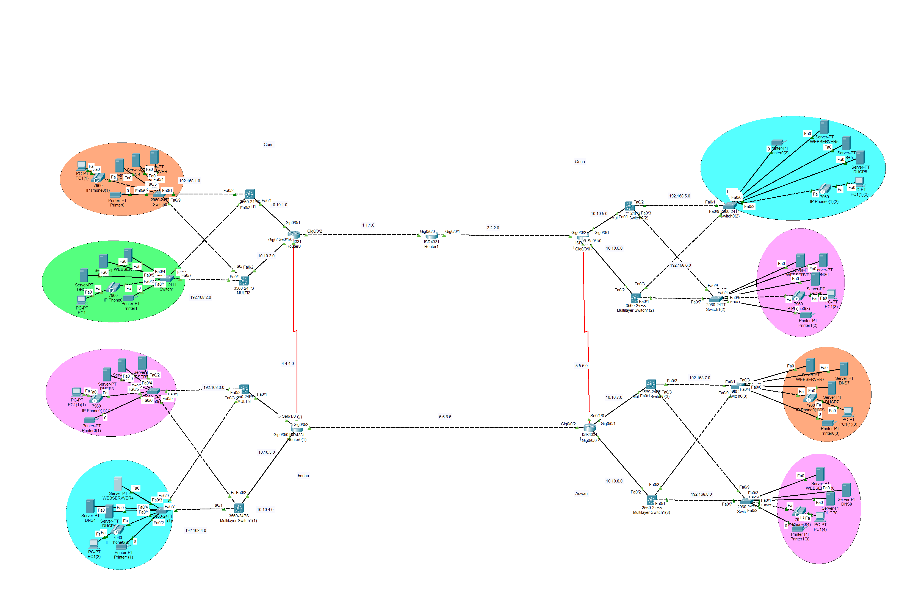
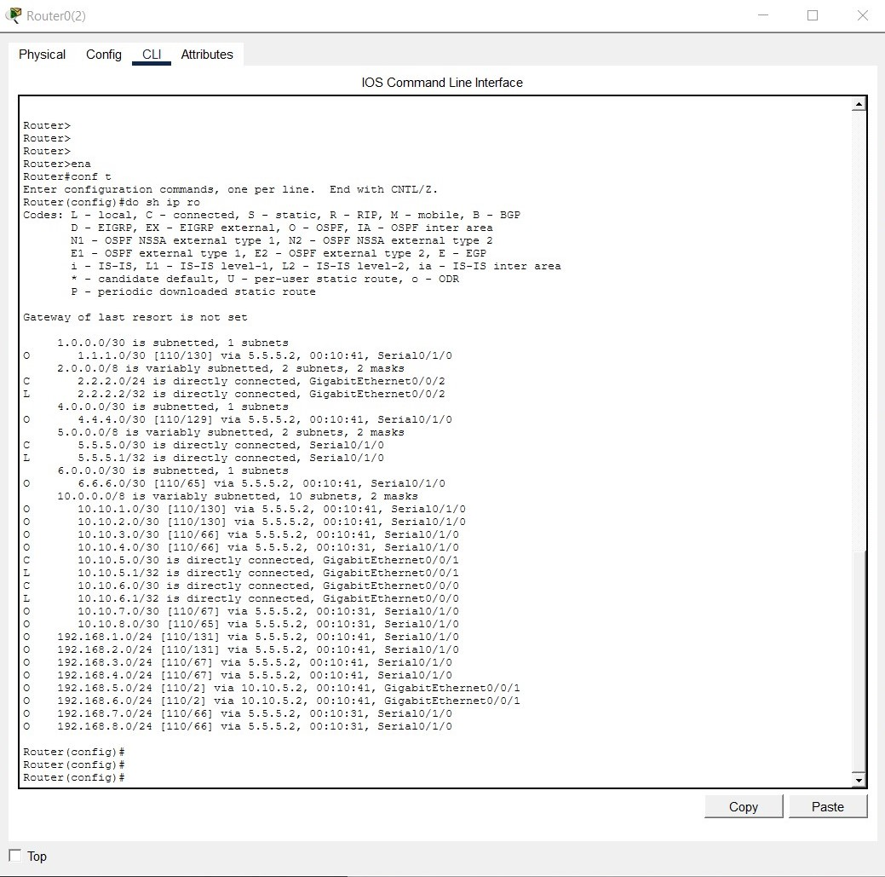
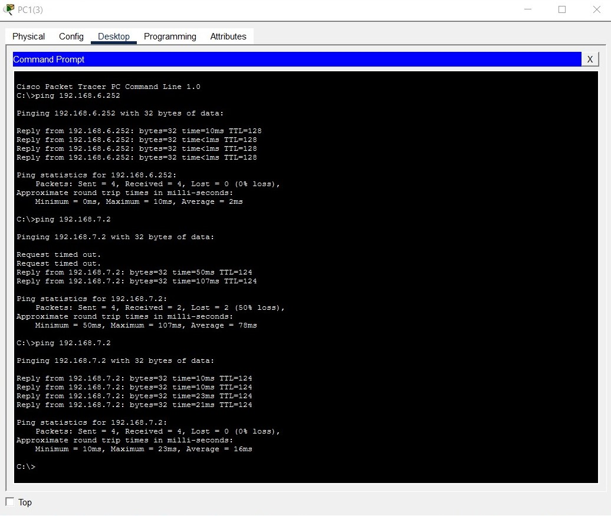

# Bank-Network-Topology
# High-Availability Multi-Branch Banking Network Simulation

A secure, redundant, and highly available enterprise banking network architecture designed and simulated using **Cisco Packet Tracer**. This project simulates a critical banking infrastructure interconnecting major regional branches (Cairo, Qena, Aswan, and Baha) utilizing advanced dynamic routing failover and Voice over IP (VoIP) solutions.

---

## 🗺️ Network Topology

### 📐 Project Architecture & Business Value
In banking infrastructures, downtime translates directly to financial loss. Therefore, this network is built with **full hardware and link redundancy**. Branches are cross-connected via multiple WAN serial links, ensuring that if any primary link or router fails, network traffic automatically self-heals and reroutes without disrupting banking operations.

---

## 🛠️ Key Technical Implementations

### 1. Robust WAN Routing & Failover
* **Dynamic Routing (OSPF):** Deployed single-area OSPF across all core and regional branch routers. It continuously calculates the shortest path and provides near-instantaneous traffic failover between cities in the event of an outage.
* **Redundant Path Design:** Configured mesh-like serial interconnections between Cairo, Baha, Qena, and Aswan to eliminate single points of failure.

### 2. Branch LAN Architecture & Voice Integration
* **Layer 3 Switching Aggregation:** Utilined 3560 Multilayer switches at each regional headquarters to aggregate local traffic and deliver line-rate Inter-VLAN routing.
* **Voice over IP (VoIP) Services:** Implemented IP telephony across branches. Configured Cisco Unified Communications features (Cisco Call Manager Express) to allocate directory numbers and enable seamless, internal voice communication for bank employees.

### 3. IP Addressing & Subnet Organization
* **Structured Subnetting:** Applied a clean IP addressing scheme across the network space to separate sensitive banking transactional zones, management interfaces, and VoIP voice traffic.

---

## 📊 Verification & Testing

### 1. Core Routing Table Convergence
The routing table output below (from the core infrastructure) highlights a fully converged network. The abundance of **OSPF routes (`O`)** proves that all remote subnets across Cairo, Qena, Aswan, and Baha are dynamically learned and reachable:

### 2. End-to-End Connectivity (Ping Tests)
Successful ICMP ping executions verify stable, end-to-end communication across different regional branches and subnets, overcoming initial ARP/STP overhead:

---

## 🚀 How to Run the Project

1. Download and install **Cisco Packet Tracer** (Version 8.x recommended).
2. Clone this repository or download the `.pkt` file
